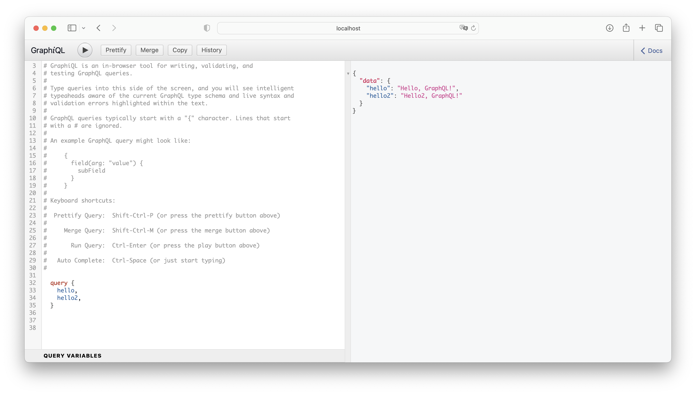
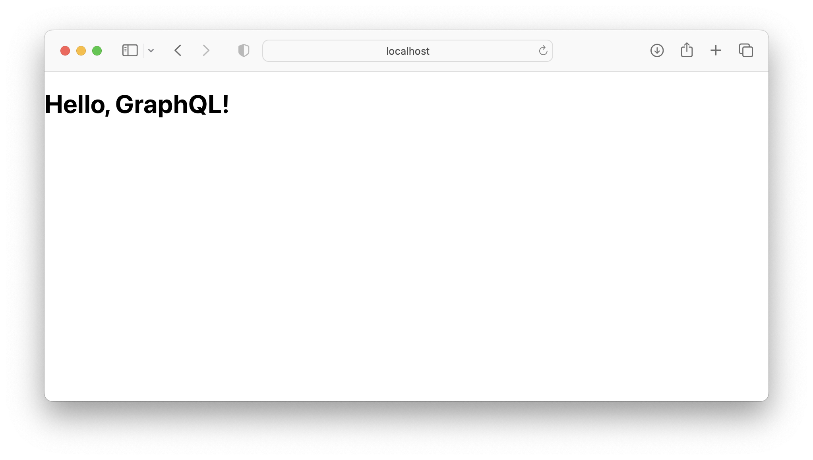

# GraphQL Sample

## Requirements

- Docker & Docker Compose

## Usage

1. Build & Up docker container

```
docker-compose -d --build
```

2. Access web pages

Backend(GraphiQL): http://localhost:3001/graphql



Frontend: http://localhost:3000/


